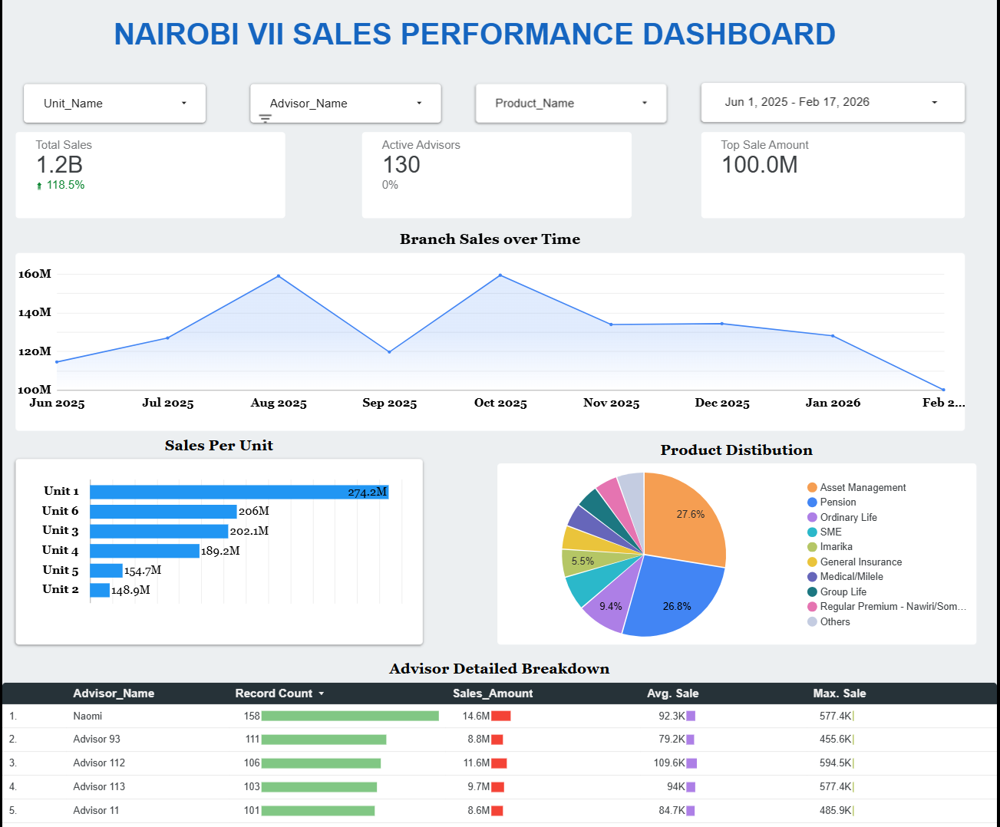

# Sales Performance and KPI Tracking System

## Business Context
This project was designed for one branch of a client that needed a tracking system for their sales team. The branch has significant amounts of data on its sales that has been underutilized, and leadership lacks insight into branch financial advisors' sales performance. This project thoroughly analyzes and synthesizes this data in order to uncover critical insights that will improve the branch’s sales revenue and effectively monitor financial advisor participation.

## 🎯 Executive Summary
This project is a high-integrity **Sales Operations Tool** designed to provide real-time visibility into revenue targets, team performance, and monthly growth trends. I engineered this system to replace static spreadsheets with a dynamic, automated tracking environment.

## 📈 Results & Impact
- Replaced manual weekly spreadsheet reporting, saving the branch manager approximately **3 hours per week**
- Enabled leadership to identify underperforming financial advisors within the **first month** of deployment
- Provided real-time visibility into product line distribution, previously unavailable to branch unit managers
- Dashboard auto-refreshes every Friday, eliminating manual data pulls entirely

## Tools Used
Google Sheets  
Looker studio  
Excel

## Stakeholders
Branch Manager  
Branch Unit managers

## Business Requirements
To increase visibility to the performance of sales agents within one branch. </br? 
To have a better understanding of the participation of different sales agents to the overal branch performance.

### Functional Requirements
The solution should track the general sales performance of the branch over time by unit branch, financial advisor, and product line. 
The solution should allow the user to apply preferred filters depending on which sales question they want to answer; by branch unit, by financial advisor, by product 
The solution should be able to show the financial advisor participation into the sales revenue i.e how many unique sales contributed to the sales revenue 
The solution should also allow the user to drill down on a specific financial advisor sales performance and participation over time 
The solution should identify underperforming Financial advisors, branch units, and product line.

### Non-Functional Requirements
The users will have access to the dashboard but not the dataset feeding the dashboards. 
There will be one data manager who updates the dataset with new sales records. 
The dataset is updated with new records every Friday of the week 
The dashboard visuals update automatically.

> **Note:** The dataset used in this project is synthetic, generated with parameters that closely reflect the client's real sales scenario. Raw data was withheld for confidentiality reasons.

## Dataset Used
### Source
The data used was a mock sales dataset that was generated with parameters that matched the client’s sales scenario.

- <a href="https://github.com/Estyell/Sales_Tracking_Dashboard/blob/main/DemoDashboard_Data.xlsx">Dataset</a>

### Cleaning & Transformations
#### Key Assumptions
Each row represents one sales transaction

#### Process
•	Verify the dataset to ensure there is no missing data
•	Ensure the data is consistent and clean with respect to data types, data format, and data values used.

#### Data Structure
Dropdowns are introduced on Advisor_Name, Product_Name to ensure data integrity
A transaction ID column is introduced to ensure uniqueness in each sales record

## KPI Questions
•	What is the performance of each financial advisor? 
•	What is the participation of each financial advisor? 
•	What is the performance of each branch unit? 
•	What is the participation of each branch unit? 
•	How are the different product lines distributed? 
•	How is the performance of the financial advisors over time? 

### KPIs
- Sales Revenue
- Sales growth with previous period - tracks sales performance
- Average sales amount - indicated sales value/ performance of branch
- Average sales count - indicates financial advisor participation
- Top sale - showcases top financial advisor and product
- Sales performance unitwise - which branch is carrying the branch?
- Sales performance productwise - what is the product distribution in relation to sales revenue

### Dashboard Interaction
- <a href="https://lookerstudio.google.com/reporting/26c61395-cb55-4970-9998-00cc03f44532">View Interactive Dashboard on Looker Studio!</a>
---
📫 **Connect with me:** [LinkedIn Profile](https://www.linkedin.com/in/stella-ngei-95241565)
